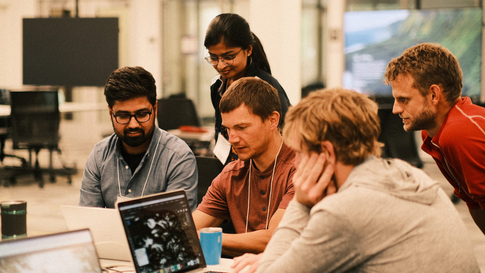

Hackweek Guidebook
==================

Hackweeks are participant-driven events that strive to create welcoming spaces for participants to learn new things, build community and gain hands-on experience with collaboration and team science.

The University of Washington's eScience Institute is interested in partnering with organizations to offer administrative, technical and educational support to facilitate hackweeks for your community.

In this website you will:

{fa}`check,text-success mr-1` [Learn more about the hackweek model](overview)
: We will describe the vision and purpose of our events and provide a roadmap for deciding if the hackweek model is a good fit for your community.

{fa}`check,text-success mr-1` [Review a list of minimum requirements for hosting a hackweek](hosting_expectations)
: We will list the resources and time commitments necessary for partnering in designing and implementing a hackweek.

{fa}`check,text-success mr-1` [Browse the services we can provide](services)
: Our team will be available to offer various levels of administrative, technical and facilitation support based on your needs and funding availability.

{fa}`check,text-success mr-1` [Learn how to submit an application](application)
: We will describe the process of applying to our program and outline steps for building a budget and submitting requests for funding to various agencies.

{fa}`check,text-success mr-1` [Additional Resources](resources)
: We provide links to additional resources that may be helpful in developing a hackweek for your community.