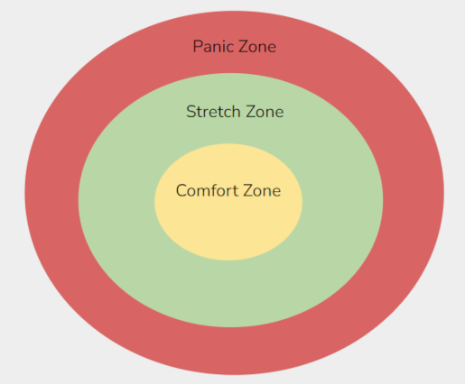
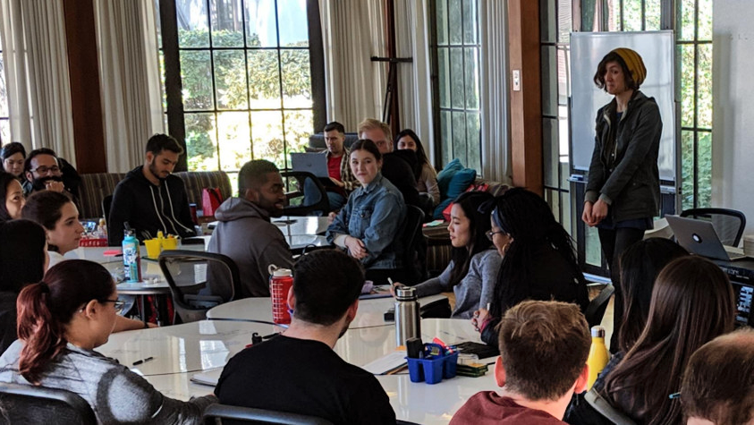

# Education Consultant

The Education Consultant has experience with designing curriculum and creating positive learning spaces for data science education.

## Goals

* Helping all participants feel able to intellectually engage in the educational and project spaces at hackweeks.
* Helping tutorial leads build content that is effective for participants across a wide range of backgrounds and experience levels.

::::{grid}
:gutter: 2

:::{grid-item}
:outline:
:columns: 5

:::
:::{grid-item}
:outline:
:columns: 7

:::

::::

## Specific Activities

* Offer a series of tutorials to hackweek organizers for best practices in data science pedagogy.
* Facilitate peer feedback sessions for hackweek tutorial leads as they develop content.
* Offer tutorials during the hackweek to teach participants about strategies for teamwork and collaboration.
* Provide content editing with a pedagogical lens for tutorial leads as they develop written content.

`````{dropdown} **People With Experience in this Role**
:open:

````{grid}

```{grid-item-card} Naomi Alterman
:columns: 3
:link: https://www.nlalterman.com/index.html
:img-top: https://escience.washington.edu/wp-content/uploads/2021/01/nlalterman.jpg
```

````
`````


