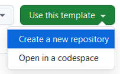

# Organizing your project on GitHub

We encourage all teams to use GitHub to coordinate sharing of ideas, data and code. Additional tools may also be provided by the hackweek organizers, such as a Slack workspace for communication (hackweek organizers can set up a Slack channel for your project team).

## Project Name

Before getting started, you'll need a name for your project. A team exploring snow surface temperatures used the name "hot-pow", and one looking at ice-ocean interactions was called "floes-are-swell". Keep it short and memorable, and most of all, have fun!

## Use our GitHub Project Template

We have created a GitHub template that is pre-populated with directories and a README layout the we find works well with most teams.

We encourage all teams to create a new GitHub repository within the hackweek organization, even if it is just to point to an already-existing repository or package your team is contributing to for their project.

* Go to: [https://github.com/uwhackweek/sample_project_repository](https://github.com/uwhackweek/sample_project_repository)

* Click the green "Use this template" button on right side of page:

* Choose "Create a new repository" from the drop-down menu

* Select the GitHub organization for your hackweek from the "Owner" drop-down menu, and give your new project repository a name.

* We recommend choosing "Public" so other participants can follow progress
* Add a "topic" to your repository details (click on the gear icon next to the "About" section on your repository page) to help others find your work (e.g. `uw-hackweek-snowex2024`)

Visit the [GitHub documentation](https://docs.github.com/en/repositories/creating-and-managing-repositories/creating-a-repository-from-a-template#creating-a-repository-from-a-template) for more details on creating a repository from a template.

## Create a new GitHub team within the hackweek organization
GitHub teams provide a convenient way for you to set permissions on your project repository for groups of people, rather than having to do this for each individual on your team. 

1. Go to the "Teams" tab near the top of the GitHub hackweek organization page
1. Click green “New team” button
1. Use your short project name for "Team name"
1. Set the team to visibility "Visible"
1. Click on the "Create Team" button
1. Add all team members by clicking the “Members” tab and the green “Add a member” button

## Add the project team to your project repo 

1. Go to the new repository you just created 
1. Click “Settings” tab in upper right corner
1. Select “Manage access” on left side of page
1. Add your team name under the "Manage access" section
1. Select “write” to enable all team members to make commits

Visit the [GitHub documentation](https://docs.github.com/en/organizations/organizing-members-into-teams/creating-a-team) for more details on creating a team.
