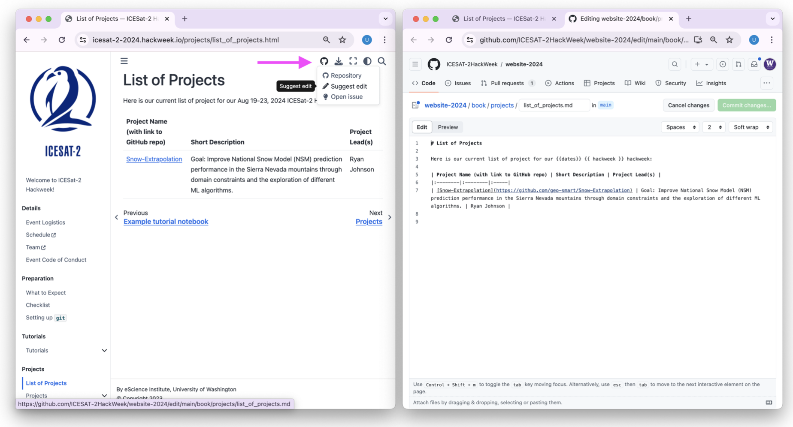
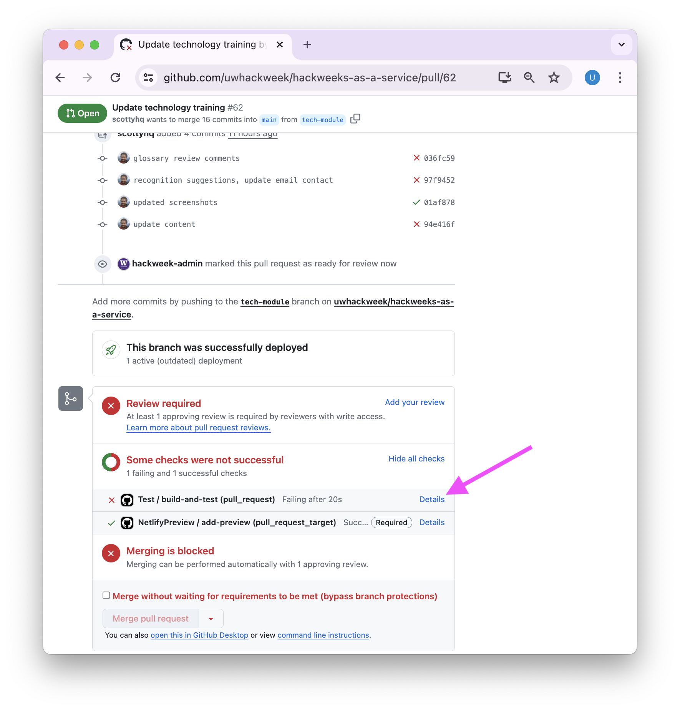

# Jupyter Book

In order to consolidate Hackweek Tutorials and Project highlights we create a public website using {term}`Jupyter Book`. In brief, `Jupyter Book` is software that converts certain document formats such as Markedly Structured Text ({term}`MyST`) and Jupyter Notebooks into a static HTML website.

We host the websites source content in a GitHub Repository and publish it using {term}`GitHub Pages`. Whatever content is on the `main` branch of a website corresponds to what is rendered on the web. So for example:

https://github.com/snowex-hackweek/website-2024 -> https://snowex-hackweek.github.io/website-2024

```{note}
We pay a small annual fee to put everything under a custom domain instead of the default GitHub Pages URL so that the website is also available at https://snowex-2024.hackweek.io
```

Because we want the website to always be functional, we suggest a Pull Request workflow where changes can be previewed and tested before merging into the `main` branch.


## Contributing changes to a website

### Single page edits

If you are making edits to text on a specific page, Jupyer Book websites have a very convenient "Suggest Edit" feature that connects you to the correct source file in a linked GitHub respository. Below you can see a side-by-side image of the website view and the source page view:



You can make changes via the GitHub interface, click 'Commit changes...' and open a Pull Request to merge your

### Multipage edits

Tutorials often include changes to multiple files including the Jupyter Book table of contents, and Jupyter Notebooks with code examples. For these additions we recommend following the Contributing Guide in the book repository (for example https://github.com/snowex-hackweek/website-2024/blob/main/CONTRIBUTING.md)

In brief the main workflow steps are as follows:

1. create a Fork
1. clone fork contents locally
1. create a feature branch
1. commit new and modified files to the feature branch
1. optionally test changes locally (run ./scripts/build_resources.sh)
1. push changes to your fork
1. open a pull request
1. request reviewers

## GitHub Actions

We run a series of automated checks to ensure our website is in good shape! For example, we check that the `jupyter book` command to convert all pages to HTML runs without error. We also run a spellcheck and link check workflow. We also suggest requiring at least one other person review and ['Approve' the Pull Request before merging](https://docs.github.com/en/pull-requests/collaborating-with-pull-requests/reviewing-changes-in-pull-requests/approving-a-pull-request-with-required-reviews).


Below you can see an example where one test succeeded but another failed. You can also see that we need someone to review this Pull Request before we can merge it!



Clicking on 'Details' brings up a detailed log. We can then see that we've made some spelling errors in a few files that should be fixed.


